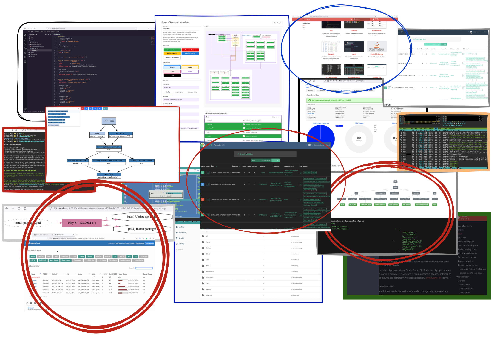

<p align="center">
  
</p>  

# Ansible-Terraform Workspace

Dockerized development environment for Ansible and Terraform. Workspace will help to create and manage infrastructures; 
visualize planned terraform changes; display ansible hosts plays; schedule and observe executions.

<p align="center">
  
</p>

## Why this images

1. If you don't want to install all of those tools separately.
2. If you need self-hosted environment to create infrastructures and schedule maintenance ansible playbooks.

## Start

```
docker run --name space-1 -d -p 8020-8040:8020-8040 -p 9000:9000 alnoda/ansible-terraform-workspace
```

and open [localhost:8020](http://localhost:8020) in browser.  

## Features

**Ansible tools:**

- [**Ansible Ara**](https://github.com/ansible-community/ara)
- [**Ansible-cmdb**](https://github.com/fboender/ansible-cmdb)
- [**Ansible inventory grapher**](https://github.com/willthames/ansible-inventory-grapher)
- [**Ansible Playbook Grapher**](https://github.com/haidaraM/ansible-playbook-grapher)
- [**Ansible Lint**](https://ansible-lint.readthedocs.io/en/latest/installing.html)
- [**Ansible Doctor**](https://ansible-doctor.geekdocs.de/)

**Terraform tools:**

- [**Pre-commit-terraform**](https://github.com/antonbabenko/pre-commit-terraform)
- [**Rover**](https://github.com/im2nguyen/rover)
- [**Blast-Radius**](https://github.com/28mm/blast-radius)
- [**Terraform Visual**](https://github.com/hieven/terraform-visual)
- [**Terraform Graph**](https://www.terraform.io/docs/cli/commands/graph.html)
- [**Inframap**](https://github.com/cycloidio/inframap)

**Dev tools:**

- [**Eclipse Theia**](https://theia-ide.org/docs/) - open source version of popular Visual Studio Code IDE. Theia is trully open-source, has 
VS-Code extensions and works in browser. This means it can run inside a docker container on local machine or in cloud. A lot of beautiful color themes and many common plugins are already installed to save time.  
- [**Terminal**](https://github.com/tsl0922/ttyd) - secure browser-based terminal.
- [**FileBrowser**](https://github.com/filebrowser/filebrowser)  - manage files and folders inside the workspace, and exchange data between local environment and the workspace
- [**Cronicle**](https://github.com/jhuckaby/Cronicle)  - task scheduler and runner, with a web based front-end UI. It handles both scheduled, repeating and on-demand jobs, targeting any number of worker servers, with real-time stats and live log viewer.
- [**Static File Server**](https://github.com/vercel/serve) - view any static html sites as easy as if you do it on your local machine. Serve static websites easily.
- [**Ungit**](https://github.com/FredrikNoren/ungit) - rings user friendliness to git without sacrificing the versatility of it.
- [**MkDocs**](https://squidfunk.github.io/mkdocs-material/)  - create awesome documentation for your project with only markdown. 
- [**Midnight Commander**](https://midnight-commander.org/)  - Feature rich visual file manager with internal text viewer and editor. 
- [**Process Monitor**](https://htop.dev/)  - Monitor running process and resource utilization. 
- Quicklaunch UI with getting started tutorial

Image is built from **Ubuntu 20.4** with the additional CLI apps

- [Zsh](https://www.zsh.org/), [Oh my Zsh](https://ohmyz.sh/)
- Python 3, Pip 
- Node/nodeenv
- curl, wget, telnet, jq
- **Git:** git, git-flow, lazygit 
- **File browsers:** mc, xplr
- **Text editors:** nano, vim, mcedit
- **System monitors:** ncdu, htop, glances, vizex
- **Process Control:** supervisord
- **Job scheduler:** cron

## Docs

See our guides

- [**project docs**](https://docs.alnoda.org/)
- [**getting started - Ansible**](https://docs.alnoda.org/ansible-terraform-workspace/ansible-tools/)
- [**getting started - Terraform**](https://docs.alnoda.org/ansible-terraform-workspace/terraform-tools/)

## Demo 

<div align="center" style="font-style: italic;">
    Demo: Ansible-Terraform workspace
</div>

<p align="center">
  
</p>
