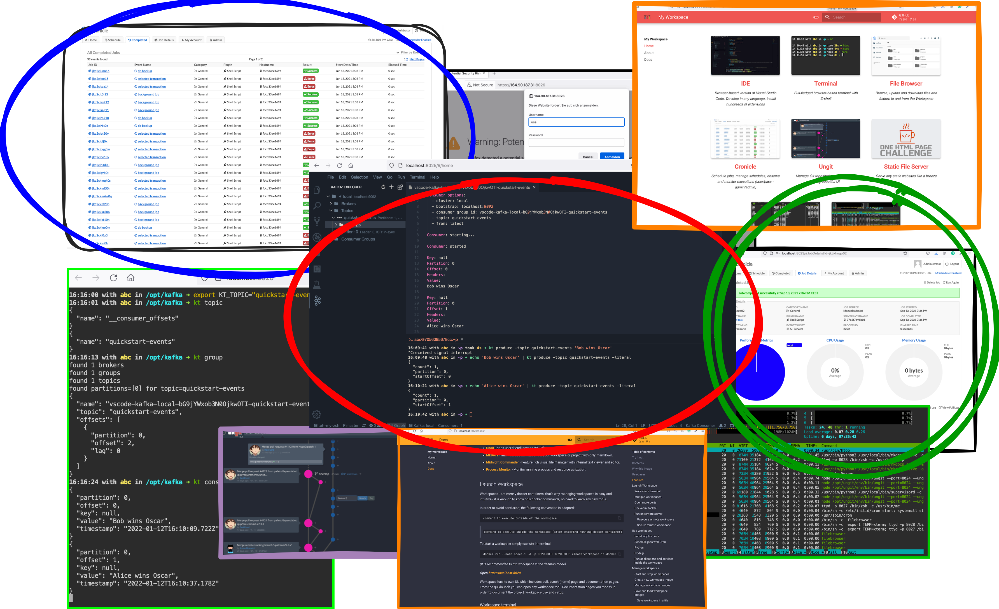

<p align="center">
  
</p>  

# Kafka workspace

Containerized environment to interact, manage and administer Kafka cluster.

<p align="center">
  
</p>

## Why this images

1. If you need a tool to interact with Kakfa, such as produce and consume events, explore, manage, query 
and troubleshoot your Kafka clusters

2. To directly access Kafka inside your kubernetes cluster.

3. A better Kafka docker image for local dev environment. You get single-nnode Kafka together with the toolset to work with it.

4. If you want to get started with Kafka easy and fast. Motivation explained in [this Medium article](https://medium.com/@bluxmit/the-better-development-experience-with-kafka-54f15705a8ee)

## Start
 
```
docker run --name rwid-1 -d -p 8020-8040:8020-8040 alnoda/kafka-workspace
```  

and open [localhost:8020](http://localhost:8020) in browser.  

## Features

**Single-node Kafka cluster**

**Kafka CLI tools**

- [kcat](https://github.com/edenhill/kcat) - generic non-JVM producer and consumer for Apache Kafka.
- [kafkactl](https://github.com/deviceinsight/kafkactl) - command-line interface for interaction with Apache Kafka.
- [trubka](https://github.com/xitonix/trubka) - Kafka CLI tool built in Go which gives you everything you need.
- [kt](https://github.com/fgeller/kt) - Kafka tool that likes JSON.
- [kcli](https://github.com/cswank/kcli) - Kafka read only command line browser.

**Dev tools:**

- [**Eclipse Theia**](https://theia-ide.org/docs/) - open source version of popular Visual Studio Code IDE. Theia is trully open-source, has 
VS-Code extensions and works in browser. This means it can run inside a docker container on local machine or in cloud. A lot of beautiful color themes and many common plugins are already installed to save time.
- [**Terminal**](https://github.com/tsl0922/ttyd) - secure browser-based terminal.
- [**FileBrowser**](https://github.com/filebrowser/filebrowser)  - manage files and folders inside the workspace, and exchange data between local environment and the workspace
- [**Ungit**](https://github.com/FredrikNoren/ungit) - rings user friendliness to git without sacrificing the versatility of it.
- **Ubuntu 20.4** with the following CLI apps
    - [Zsh](https://www.zsh.org/), [Oh my Zsh](https://ohmyz.sh/)
    - Python 3, Pip 
    - Node/nodeenv
    - curl, wget, telnet, jq
    - **Git:** git, git-flow, lazygit 
    - **File browsers:** mc
    - **Text editors:** nano, vim, mcedit
    - **System monitors:** ncdu, htop, glances, vizex
    - **Process Control:** supervisord
    - **Job scheduler:** cron
    - **Terminal multiplexer:** tmux 

## Docs

See our guides

- [**getting started**](https://docs.alnoda.org/get-started/common-features/)
- [**workspace tutorial**](https://docs.alnoda.org/kafka-workspace/tutorial/)
- [**workspace docs**](https://docs.alnoda.org/kafka-workspace/)
- [**project docs**](https://docs.alnoda.org/)
