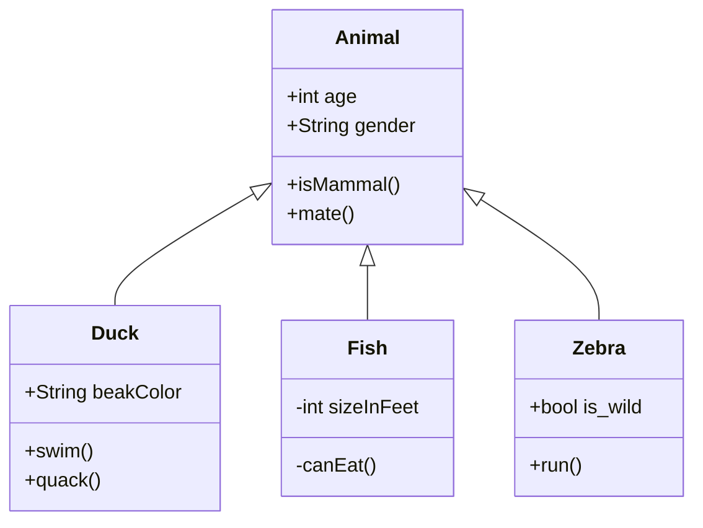

Few of the Extended Markdown features

#### Code 
```{.py3 linenums="1" hl_lines="5-7"}
def insertion_sort(nums):
    for i in range(1, len(nums)):
        item_to_insert = nums[i]
        j = i - 1
        while j >= 0 and nums[j] > item_to_insert:
            nums[j + 1] = nums[j]
            j -= 1
        nums[j + 1] = item_to_insert
```

#### Emoji

:smile: :heart: :thumbsup: :100: :muscle: :accept: :point_up: :airplane: :champagne: :raised_hands: :boom: :laughing: :metal: :handshake: :older_man: :sheep: :no_entry: :mouse: :relieved: :question: :wink: :wave: :rainbow: :sleeping:  

#### Critic

We Uber drivers never know whom we’re going to end up with as a passenger {--in the same car--}. 
One day, I was driving over a new bridge, the design of which was very {~~confusing~>ugly~~}. 
Completely confounded, {==I muttered==}{>>Actually I said it out loud<<}, “I’d love to meet the {~~genius~>retard~~} 
who designed this mess.” With that, my passenger {==extended his hand in my direction==}{>>I thought he wanted to choke me<<} 
and said, “Well, today is your {--*very*--} lucky day. My name is Mike, I work for the county engineer’s office, 
and I’m the {==genius==}{>>obviously an irony<<} who designed this!”. Surprisingly, he still gave me a tip {++**of 2 dollars**++}.  

#### Keys

++enter++   ++tab++   ++space++   ++arrow-up++  ++arrow-down++   ++page-up++    ++home++    ++backspace++    ++insert++

#### Tabls, lists & admonitions

!!! example "Tasklist"
    === "Output"
        - [X] Plans at work
            * [X] Make vanilla pudding. Put in mayo jar. Eat in the office during the lunch break
            * [X] Wear shirt that says “Life”. Hand out lemons to colleagues.
            * [ ] Hire two private investigators. Get them to follow each other.
        - [ ] Personal plans
            * [X] Make an alcoholic beverage and name it “responsibly.” Start drinking Responsibly.
            * [ ] Sneeze in front of the Pope. Get blessed.
            * [ ] Buy a horse, name it “Oscar Takes The Lead,” enter it in horse races.

    === "Markdown"
        ```
        - [X] Plans at work
            * [X] Make vanilla pudding. Put in mayo jar. Eat in the office during the lunch break
            * [X] Wear shirt that says “Life”. Hand out lemons to colleagues.
            * [ ] Hire two private investigators. Get them to follow each other.
        - [ ] Personal plans
            * [X] Make an alcoholic beverage and name it “responsibly.” Start drinking Responsibly.
            * [ ] Sneeze in front of the Pope. Get blessed.
            * [ ] Buy a horse, name it “Oscar Takes The Lead,” enter it in horse races.
        ```

#### Tables

**Substance** | **Description**
:--- | ---: 
**Bombastium** | Rarest element in the world. Dropped into a barrel of water becomes one barrel of ice cream
**Jerktonium** | Ingestion of jerktonium causes a bad attitude, but the effects are curable by song.
**Philote** | The smallest possible particle, occupying no space at all.

#### Formulas

$$
\left(\frac{\left(\sqrt{\frac{73^2}{12x}}\sqrt{\frac{x|x|}{\log_x}}\right)}{\sqrt[3]{\frac xy}}\right)
$$  

#### Diargams

