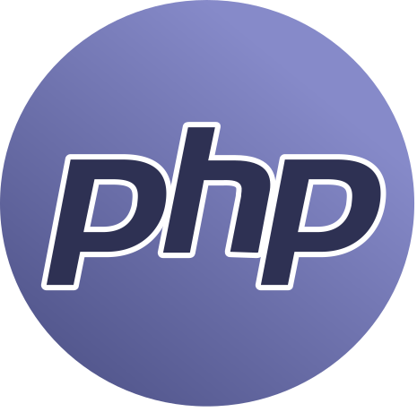

<p align="center">
  
</p>  

# PHP workspace 

Containerized isolated development environment for PHP coding.  
Includes PHP, Composer, code editor, terminal, filebrowser and git manager. 

## Why this images

1. If you need self-hosted remote development environment.
2. If you want to be one command away from coding in PHP.

## Start
 
```
docker run --name space-1 -d -p 8020-8040:8020-8040 alnoda/php-workspace
```  

open [localhost:8020](http://localhost:8020) in browser.  

## Features

- PHP 
- [Composer](https://getcomposer.org/)

**Dev tools:**

- [**Code-server**](https://github.com/cdr/code-server) - open source version of popular Visual Studio Code IDE. Codeserver has 
VS-Code extensions and works in browser. 
- [**Terminal**](https://github.com/tsl0922/ttyd) - secure browser-based terminal.
- [**FileBrowser**](https://github.com/filebrowser/filebrowser)  - manage files and folders inside the workspace, and exchange data between local environment and the workspace
- [**Ungit**](https://github.com/FredrikNoren/ungit) - rings user friendliness to git without sacrificing the versatility of it.
- **Ubuntu 20.4** with the following CLI apps
    - [Zsh](https://www.zsh.org/), [Oh my Zsh](https://ohmyz.sh/)
    - Python 3, Pip 
    - Node/nodeenv
    - curl, wget, telnet, jq
    - **Git:** git, git-flow, lazygit 
    - **File browsers:** mc
    - **Text editors:** nano, vim, mcedit
    - **System monitors:** ncdu, htop, glances, vizex
    - **Process Control:** supervisord
    - **Job scheduler:** cron
    - **Terminal multiplexer:** tmux 

## Docs

See our guides on 

- [**getting started**](https://docs.alnoda.org/get-started/common-features/)
- [**workspace tutorial**](https://docs.alnoda.org/php-workspace/tutorial/) 
- [**project docs**](https://docs.alnoda.org/)

