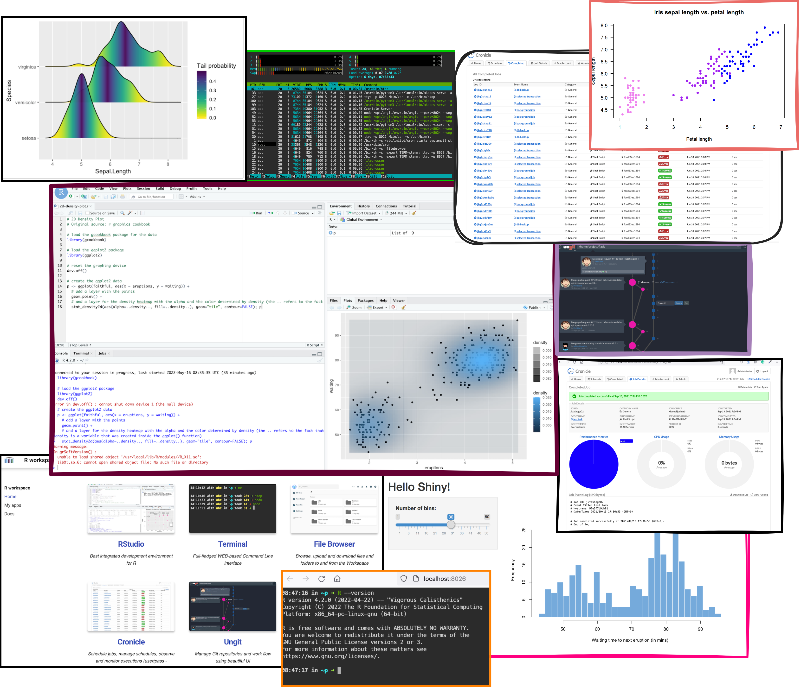

<p align="center">
  
</p>  

# R workspace 

Docker image with R and browser-based RStudio version. 

<p align="center">
  
</p>

## Why this images

1. You need self-hosted remote development environment for R.
2. You want to be one 'docker run' command away from having everything needed to work with R.
3. You need isolated environment where you can work with R without affecting main environment.
4. You need an environment that you can "move" to a more powerful machine if needed.

## Start
 
```
docker run --name space-1 -d -p 8020-8040:8020-8040 alnoda/r-workspace
```  

and open [localhost:8020](http://localhost:8020) in browser.  

## Features

- [R](https://www.r-project.org/) 

**Dev tools:**

- **RStudio server** - open source version of popular R IDE, browser-based. 
- [**Terminal**](https://github.com/tsl0922/ttyd) - secure browser-based terminal.
- [**FileBrowser**](https://github.com/filebrowser/filebrowser)  - manage files and folders inside the workspace, and exchange data between local environment and the workspace
- [**Cronicle**](https://github.com/jhuckaby/Cronicle)  - task scheduler and runner, with a web based front-end UI. It handles both scheduled, repeating and on-demand jobs, targeting any number of worker servers, with real-time stats and live log viewer.
- [**Static File Server**](https://github.com/vercel/serve) - view any static html sites as easy as if you do it on your local machine. Serve static websites easily.
- [**Ungit**](https://github.com/FredrikNoren/ungit) - rings user friendliness to git without sacrificing the versatility of it.
- [**MkDocs**](https://squidfunk.github.io/mkdocs-material/)  - create awesome documentation for your project with only markdown. 
- [**Midnight Commander**](https://midnight-commander.org/)  - Feature rich visual file manager with internal text viewer and editor. 
- [**Process Monitor**](https://htop.dev/)  - Monitor running process and resource utilization. 
- Quicklaunch UI with getting started tutorial

Image is built from **Ubuntu 20.4** with the additional CLI apps

- [Zsh](https://www.zsh.org/), [Oh my Zsh](https://ohmyz.sh/)
- Python 3, Pip 
- Node/nodeenv
- curl, wget, telnet, jq
- **Git:** git, git-flow, lazygit 
- **File browsers:** mc, xplr
- **Text editors:** nano, vim, mcedit
- **System monitors:** ncdu, htop, glances, vizex
- **Process Control:** supervisord
- **Job scheduler:** cron

## Docs

See our guides on 

- [**getting started**](https://docs.alnoda.org/get-started/common-features/)
- [**workspace tutorial**](https://docs.alnoda.org/r-workspace/tutorial/) 
- [**project docs**](https://docs.alnoda.org/)
