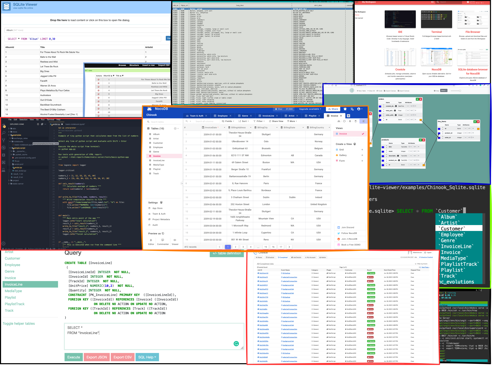

<p align="center">
  
</p>  

# SQLite Workspace

Collection of tools to develop SQLite databases.

<p align="center">
  
</p>


## Why this images

If you need to develop embedded SQLite databases and fill them with data.

## Start
 
```
docker run --name space-1 -d -p 8020-8040:8020-8040 alnoda/sqlite-workspace
```  

and open [localhost:8020](http://localhost:8020) in browser.  

## Features

**SQLite tools:**

- [nocodb](https://docs.nocodb.com/) - great UI to fill SQLite with data. NocoDB is an open source Airtable alternative. 
- [sqlite-web](https://github.com/coleifer/sqlite-web) - web-based SQLite database browser.
- [sqlean](https://github.com/nalgeon/sqlean) - the ultimate set of compiled SQLite extensions.
- [litecli](https://github.com/dbcli/litecli) - CLI for SQLite.
- [sqlite-viewer](https://github.com/inloop/sqlite-viewer) - view SQLite file online.
- [Web-GUI-for-SQLite](https://github.com/cyrilbois/Web-GUI-for-SQLite) - alternative tool to view SQLite file online.
- [DBdesigner](https://github.com/akreienbring/dbdesigner) - draw ERD diagrams and use it to generate DDL code.
- [tbls](https://github.com/k1LoW/tbls) - gnerate documentation (essentially data catalog) from the database

**SQLite extension:**

- [crypto](https://github.com/nalgeon/sqlean/blob/main/docs/crypto.md) - secure hashes
- [fileio](https://github.com/nalgeon/sqlean/blob/main/docs/fileio.md) - read and write files
- [fuzzy](https://github.com/nalgeon/sqlean/blob/main/docs/fuzzy.md) - fuzzy string matching and phonetics
- [ipaddr](https://github.com/nalgeon/sqlean/blob/main/docs/ipaddr.md): - IP address manipulation
- [re](https://github.com/nalgeon/sqlean/blob/main/docs/re.md) - regular expressions
- [stats](https://github.com/nalgeon/sqlean/blob/main/docs/stats.md) - math statistics
- [text](https://github.com/nalgeon/sqlean/blob/main/docs/text.md) - string functions
- [unicode](https://github.com/nalgeon/sqlean/blob/main/docs/unicode.md) - Unicode support
- [uuid](https://github.com/nalgeon/sqlean/blob/main/docs/uuid.md) - universally Unique IDentifiers

**Dev tools:**

- [**Eclipse Theia**](https://theia-ide.org/docs/) - open source version of popular Visual Studio Code IDE. Theia is trully open-source, has 
VS-Code extensions and works in browser. This means it can run inside a docker container on local machine or in cloud. A lot of beautiful color themes and many common plugins are already installed to save time.  
- [**Terminal**](https://github.com/tsl0922/ttyd) - secure browser-based terminal.
- [**FileBrowser**](https://github.com/filebrowser/filebrowser)  - manage files and folders inside the workspace, and exchange data between local environment and the workspace
- [**Cronicle**](https://github.com/jhuckaby/Cronicle)  - task scheduler and runner, with a web based front-end UI. It handles both scheduled, repeating and on-demand jobs, targeting any number of worker servers, with real-time stats and live log viewer.
- [**Static File Server**](https://github.com/vercel/serve) - view any static html sites as easy as if you do it on your local machine. Serve static websites easily.
- [**Ungit**](https://github.com/FredrikNoren/ungit) - rings user friendliness to git without sacrificing the versatility of it.
- [**MkDocs**](https://squidfunk.github.io/mkdocs-material/)  - create awesome documentation for your project with only markdown. 
- [**Midnight Commander**](https://midnight-commander.org/)  - Feature rich visual file manager with internal text viewer and editor. 
- [**Process Monitor**](https://htop.dev/)  - Monitor running process and resource utilization. 
- Quicklaunch UI with getting started tutorial

Image is built from **Ubuntu 20.4** with the additional CLI apps

- [Zsh](https://www.zsh.org/), [Oh my Zsh](https://ohmyz.sh/)
- Python 3, Pip 
- Node/nodeenv
- curl, wget, telnet, jq
- **Git:** git, git-flow, lazygit 
- **File browsers:** mc, xplr
- **Text editors:** nano, vim, mcedit
- **System monitors:** ncdu, htop, glances, vizex
- **Process Control:** supervisord
- **Job scheduler:** cron

## Docs

See our guides on 

- [**getting started**](https://docs.alnoda.org/get-started/common-features/)
- [**workspace tutorial**](https://docs.alnoda.org/sqlite-workspace/tutorial/) 
- [**project docs**](https://docs.alnoda.org/)
