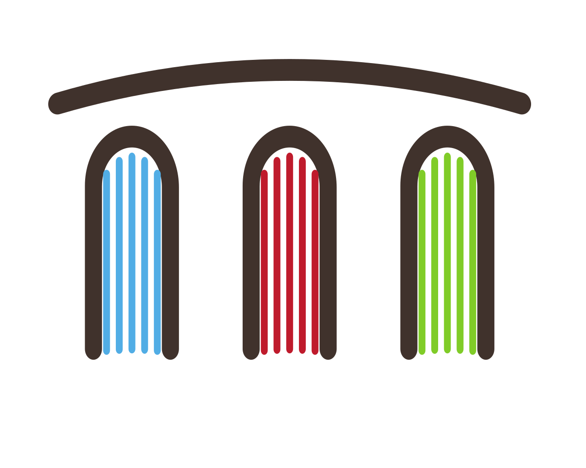

<p align="center">
  
</p>  

# Streamlit workspace 

Docker image for building Streamlit applications.

<p align="center">
  
</p>

## Why this images

1. If you need self-hosted environment for Streamlit app development.
2. If you want to be one command away from coding Streamlit apps.

## Start
 
```
docker run --name space-1 -d -p 8020-8040:8020-8040 alnoda/streamlit-workspace
```  

and open [localhost:8020](http://localhost:8020) in browser.  

## Features

- [Streamlit](https://docs.streamlit.io/)

**Python tools:**

- [IPython and Notebooks](https://ipython.readthedocs.io/en/stable/)
- [Pdoc3](https://github.com/pdoc3/pdoc)
- [Pytest-html-reporter](https://github.com/prashanth-sams/pytest-html-reporter)
- [SnakeViz](https://jiffyclub.github.io/snakeviz/)
- [Vprof](https://github.com/nvdv/vprof)
- [Pyinstrument](https://pypi.org/project/pyinstrument/3.0.0b3/)
- [Flameprof](https://github.com/baverman/flameprof/)
- [Pylint-json2html](https://github.com/Exirel/pylint-json2html)
- [Pre-commit](https://pre-commit.com/)
- [Flake8](https://flake8.pycqa.org/en/latest/)
- [Poetry](https://python-poetry.org/)
- [Black](https://github.com/psf/black)

**Dev tools:**

- [**Eclipse Theia**](https://theia-ide.org/docs/) - open source version of popular Visual Studio Code IDE. Theia is trully open-source, has 
VS-Code extensions and works in browser. This means it can run inside a docker container on local machine or in cloud. A lot of beautiful color themes and many common plugins are already installed to save time.  
- [**Terminal**](https://github.com/tsl0922/ttyd) - secure browser-based terminal.
- [**FileBrowser**](https://github.com/filebrowser/filebrowser)  - manage files and folders inside the workspace, and exchange data between local environment and the workspace
- [**Cronicle**](https://github.com/jhuckaby/Cronicle)  - task scheduler and runner, with a web based front-end UI. It handles both scheduled, repeating and on-demand jobs, targeting any number of worker servers, with real-time stats and live log viewer.
- [**Static File Server**](https://github.com/vercel/serve) - view any static html sites as easy as if you do it on your local machine. Serve static websites easily.
- [**Ungit**](https://github.com/FredrikNoren/ungit) - rings user friendliness to git without sacrificing the versatility of it.
- [**MkDocs**](https://squidfunk.github.io/mkdocs-material/)  - create awesome documentation for your project with only markdown. 
- [**Midnight Commander**](https://midnight-commander.org/)  - Feature rich visual file manager with internal text viewer and editor. 
- [**Process Monitor**](https://htop.dev/)  - Monitor running process and resource utilization. 
- Quicklaunch UI with getting started tutorial

Image is built from **Ubuntu 20.4** with the additional CLI apps

- [Zsh](https://www.zsh.org/), [Oh my Zsh](https://ohmyz.sh/)
- Python 3, Pip 
- Node/nodeenv
- curl, wget, telnet, jq
- **Git:** git, git-flow, lazygit 
- **File browsers:** mc, xplr
- **Text editors:** nano, vim, mcedit
- **System monitors:** ncdu, htop, glances, vizex
- **Process Control:** supervisord
- **Job scheduler:** cron

## Docs

See our guides on 

- [**getting started**](https://docs.alnoda.org/get-started/common-features/)
- [**workspace tutorial**](https://docs.alnoda.org/streamlit-workspace/tutorial/) 
- [**project docs**](https://docs.alnoda.org/)


