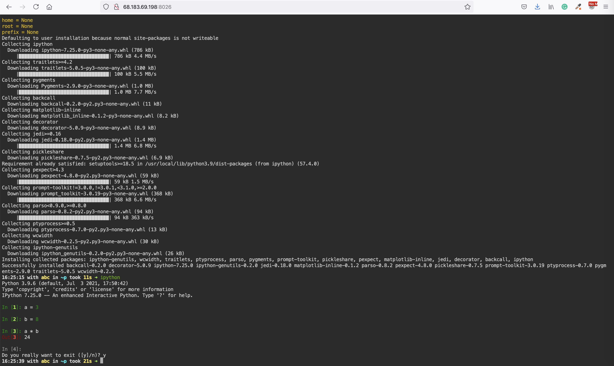
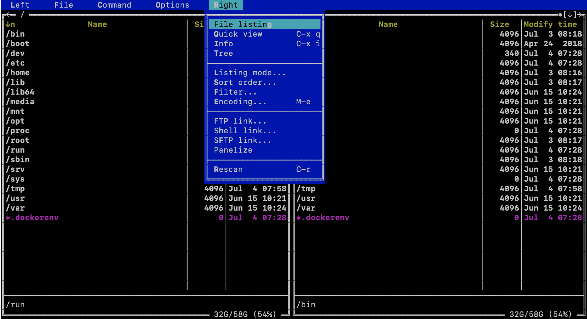
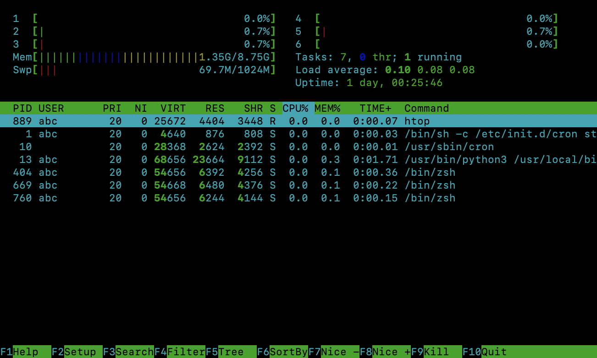
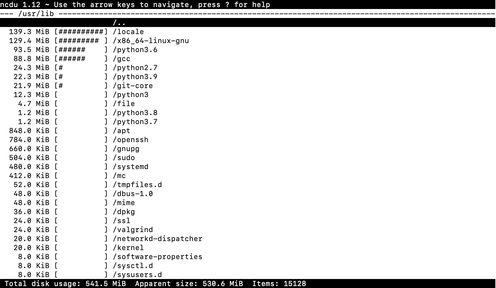
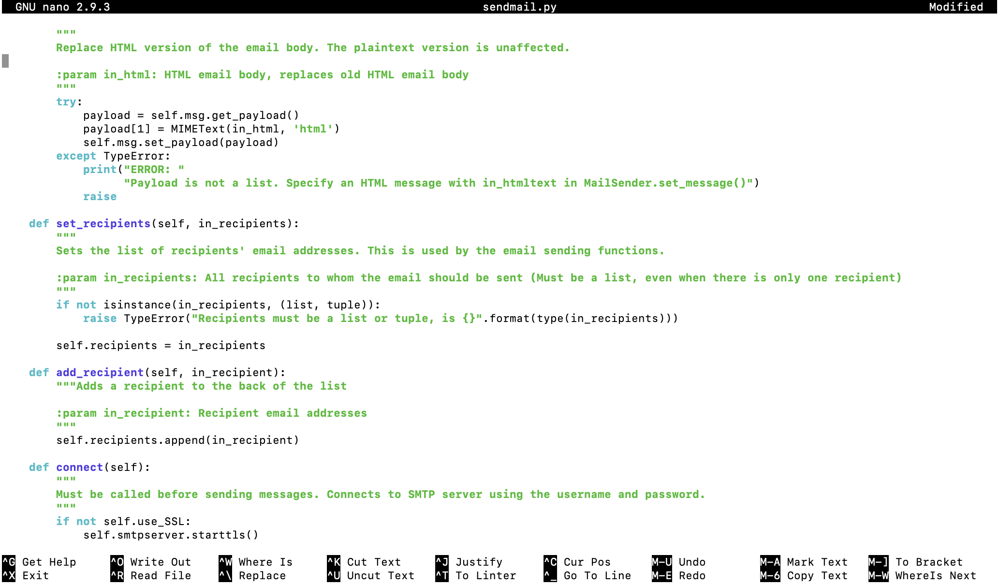
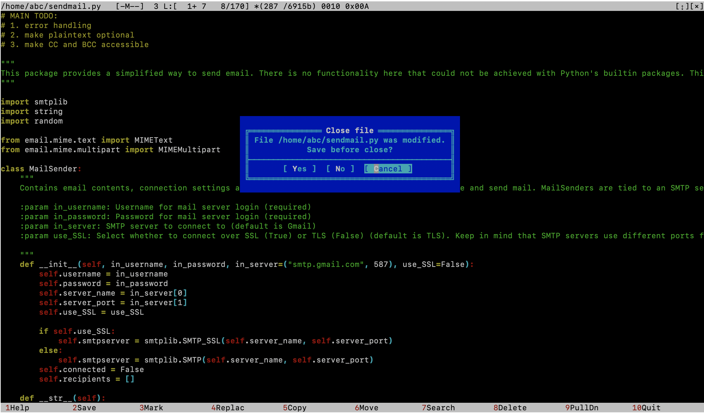

# Ubuntu-workspace

```Ubuntu-workspace``` - is an attempt to use docker as a light-weight Virtual Machine. It 
provides isolation of environments, but uses less resources than VMs.  

Ubuntu-workspace allows to start multiple processes inside the 
same docker container, has docker-in-docker, Python and Node.js, and a collection of common applications such as text editors, 
git, supervisord, z-shell etc. Ubuntu-workspace exposes browser-based terminal, and can be used on both local and remote server providing the same experience. 
When it runs on the remote server, access can be restricted with a password.

<p align="center">
  
</p>

## Contents

 * [Use-cases](#use-cases)
 * [Getting started](#getting-started)
    * [Ports](#ports)
    * [Run as root](#run-as-root)
    * [Docker in docker](#docker-in-docker)
    * [Run in cloud](#run-in-cloud)
* [Features](#features)
    * [Install new packages](#install-new-packages)
    * [Schedule jobs with cron](#schedule-jobs-with-cron)
    * [Python](#python)
    * [Node.js](#node.js)
* [Manage workspaces](#manage-workspaces)
    * [Start and stop containers](#start-and-stop-containers)
    * [Create new image](#create-new-image)
    * [Manage images](#manage-images)
    * [Save and load images](#save-and-load-images)
    * [Move workspace to the cloud](#move-workspace-to-the-cloud)
    * [Collaborate and share workspaces](#collaborate-and-share-workspaces)
* [Extra features](#extra-features)
    * [Java](#java)
    * [Run applications permanently](#run-applications-permanently)

## Use-cases

Primarily intended as an advanced Ubuntu terminal that runs anywhere, this workspace works best 
when you need interactive linux, python or node shell for ad-hock tasks.  

Ubuntu workspace is also a basis for building more sophisticated workspaces with UI interfaces.   

Ubuntu-workspace even can be used as a development environment for those 
who prefer developing directly in the terminal. For those who like more convenient 
IDE there are more suitable workspaces.  

## Getting started

In order to avoid confusion, the following convention is adopted: 

```sh
command to execute outside of the workspace
```

> `command to execute inside the workspace (after entering running docker container)`

```sh
docker run --name space-1 -d -p 8026:8026 alnoda/ubuntu-workspace
```
and open your browser on [http://localhost:8026](http://localhost:8026)  

You can also ssh into the running workspace container from your console
```sh
docker exec -it space-1 /bin/zsh
```

If you don't want to use z-shell
```
docker exec -it space-1 /bin/bash
```

***You can work in Ubuntu via terminal now.***

### Ports
In the example above, the workspace container was started with a port mapping "-p 8026:8026" in order to expose WEB-based terminal. 
This might be useful if you are planning to move your workspace to cloud server or prefer web-based terminal. 
If you are planning to work only locally and prefer your console, you might not need it, and you can start workspace without any port mappings

```sh
docker run --name space-1  -d alnoda/ubuntu-workspace
```

It might be the case that some applications will be installed and launched inside the workspace. In order to use those applications outside the workspace, 
it is necessary to add more port mappings. For example, assume we are planning to install application inside the workspace with web-ui on port 19011

```sh
docker run --name space-1 -d -p 8026:8026 -p 19011:19011 alnoda/ubuntu-workspace
```

> It is not a problem if you don't expose any ports, but later on realise you need them -
> you will just create new image, and run it exposing the required port (look in the section [Create new image](#create-new-image)) 

### Run as root
The default user is **abc** with passwordless sudo to install packages. If you'd rather work as root, then you should ssh into running container as
```sh
docker exec -it --user=root space-1 /bin/zsh
```
You can of course open several terminals to the same running containner as both abc and root users at the same time.


### Docker in docker

It is possible to work with docker directly from the workspace. 

```
docker run --name space-1 -d -p 8026:8026 -v /var/run/docker.sock:/var/run/docker.sock alnoda/ubuntu-workspace
```

NOTE: in order to use docker in docker you need to or enter into the workspace container as root
```sh
docker exec -it --user=root space-1 /bin/zsh
```

### Run in cloud

Running workspaces on the remote server is great for collaboration, heavy workloads or periodic tasks. 
Workspace has WEB-based terminal, and you will be able to use workspace from browser on any device.  

It is very easy to run your workspace in cloud on any server. You are completely independent on the 
cloud provider, can easily start, stop and move workspaces between servers.    

It is recommended to start workspace with authentication, otherwise anyone will be 
able to use your workspace. Use this simple docker-compose file to start workspace in 
cloud with basic authentication

```
version: "3.3"
services:
  traefik:
    image: "traefik:v2.4"
    container_name: "traefik"
    command:
      - "--providers.docker"
      - "--entrypoints.terminal.address=:8026"
    ports:
      - 8026:8026
    volumes:
      - "/var/run/docker.sock:/var/run/docker.sock:ro"
  workspace:
    image: alnoda/ubuntu-workspace
    labels:
      # To create user:password pair, execute in any workspace echo $(htpasswd -nB <userName>) | sed -e s/\\$/\\$\\$/g
      - "traefik.http.middlewares.basic-auth.basicauth.users=admin:$$2y$$05$$eub6CV.CwUYCCQjNBvSf5uZnzdRmVwGZ/ncxecb9O7WxCR8aLuM3K"
      - "traefik.enable=true"
      # terminal
      - "traefik.http.services.terminal.loadbalancer.server.port=8026"
      - "traefik.http.routers.terminal.service=terminal"
      - "traefik.http.routers.terminal.rule=PathPrefix(`/`)"
      - "traefik.http.routers.terminal.entrypoints=terminal"
      - "traefik.http.routers.terminal.middlewares=basic-auth"
```

This configuration launches workspace with the default authentication user:pass is **admin:admin**. 
You might want to generate new credentials.  

The password for the traefik basic auth must be encrypted with the **htpasswd**. For connvenience, 
it is installed in every workspace-in-docker, and the easiest way is to generate the password 
is to launch workspace locally first, use its terminal to create a password, and then start 
workspace on remote server.  

To encrypt password open terminal of the local workspace and execute 

> ```echo $(htpasswd -nB <userName>) | sed -e s/\\$/\\$\\$/g```  

substitute `<userName>` with the new user name, and prowide password on prompt. After this htpasswd will output encrypted password.

Don't forget to change this line in the docker-compose file with the new user:encpypted_pass

```
- "traefik.http.middlewares.basic-auth.basicauth.users=admin:$$2y$$05$$eub6CV.CwUYCCQjNBvSf5uZnzdRmVwGZ/ncxecb9O7WxCR8aLuM3K"
```

Create file ```remote-workspace-auth.yaml``` on the remote server, paste yaml from above (preferrably with new auth) 
and start workspace 

```
docker-compose -f remote-workspace-auth.yaml up -d 
```

Now you can open in browser ```http://<ip-of-remote-server>:8026```  and use WEB-based terminal to work with your remote workspace 

<p align="center">
  
</p>

Stop remote workspace

```
docker-compose -f remote-workspace-auth.yaml stop
```

Start remore workspace again

```
docker-compose -f remote-workspace-auth.yaml start
```

Delete remote workspace

```
docker-compose -f remote-workspace-auth.yaml down
```

## Features

In order to make working in the ubuntu-workspace more convenient, some terminal-based tools are installed. They 
make it easier to browse files, check running processes and resource utilisation and edit text files.  

Explore file system with Midnight Commander

> ```mc```

<p align="center">
  
</p>

Launch system-monitor, process-viewer and process-manager  
```
htop
```
<p align="center">
  
</p>

Explore file/folder sizes
```
ncdu
```
<p align="center">
  
</p>

Text editors ```vim```, ```nano``` and ```mcedit``` are available. For example, clone git repo and edit python file with nano
```
git clone https://github.com/dimaba/sendmail.git
cd sendmail
nano sendmail.py 
```
<p align="center">
  
</p>

```
mcedit sendmail.py 
```
<p align="center">
  
</p>

### Install new packages
Install new packages with ```sudo apt install```, for example emacs
```
sudo apt install emacs
```

### Schedule jobs with cron
Schedule execution of any task with cron. Create cron task with
```
crontab -e
```
*(chose [1] nano as editor)*
In the end of the opened file add line  

> `* * * * * echo $(whoami) >> /home/cron.txt`

This will print every minute username to file */home/cron.txt* . Ctrl+X to exit nano 

> ```
> Hint: example of cron job definition:   
> .---------------- minute (0 - 59)   
> |  .------------- hour (0 - 23)
> |  |  .---------- day of month (1 - 31)
> |  |  |  .------- month (1 - 12) OR jan,feb,mar,apr ...
> |  |  |  |  .---- day of week (0 - 6) (Sunday=0 or 7) OR sun,mon,tue,wed,thu,fri,sat
> |  |  |  |  |
> *  *  *  *  *  command to be executed
> ```

**NOTE** you can disconnect from the image and close terminal. cron will continue working.

### Python
Python and Pip are installed. To start python console simply execute

```
python
``` 
Install python package with pip

```
pip install pandas
```
Install and start ipython

```
pip install ipython
ipython
```

Create and activate virtual environment called 'my_env'
```
mkdir /home/pytest
cd /home/pytest && python -m venv my_env
source my_env/bin/activate
```

### Node.js
Use nodeenv to create different node environments. For example, create folder npmgui, and activate environment with node v. 12.18.3 and npm v.6.0.0

```
cd /home 
mkdir npmgui; cd npmgui
nodeenv --node=12.18.3 --npm=6.0.0 env 
```
Let's install package and start node application 

```
. env/bin/activate && npm i -g npm-gui
npm-gui 0.0.0.0:19011
```
Open your browser on http://localhost:19011/ 

*(This is why we made a port mapping with "-p 19011:19011")*

> *NOTE* If you close terminal, the application will stop. 
> Find how to run applications permanently in the section [Run applications permanently](#run-applications-permanently)


## Manage workspaces

Workspace is just a docker container. You can start, stop, delete and do anything ypou can do with docker images and containers.    

Essentially, there are two concepts: **images** and **containers**. Images are workspace blueprints. **alnoda/ubuntu-workspace** is an 
image. When you execute this command 

```sh
docker run --name space-1 -p 8026:8026 -d alnoda/ubuntu-workspace
```
you create container called **space-1** from the image **alnoda/ubuntu-workspace**. You can create any number of containers.  
Container - is your workspace. You can start, stop annd delete them.  

From the workspace (which is a container) you can create new image. This is called **committing**. Essentially, this means *"take my workspace and create new image with all the changes I've done in my workspace*"

### Start and stop containers

The workspace started in daemon mode will continue working in the background. 

See all the running docker containers

```
docker ps
```

Stop workspace

```sh
docker stop space-1 
```
Workspace is stopped. All the processes and cron jobs are not running. 

See all docker conntainers, including stopped

```
docker ps -a
```

Start workspace again. Processes and cron jobs are resumed. 

```sh
docker start space-1 
```

Delete workspace container (all work will be lost)

```
docker rm space-1 
```

### Create new image

Having made changes, you can commit them creating new image of the workspace. In order to create new workspace image with the 
name "space-image" and version "0.2" execute

``` 
docker commit space-1 space-image:0.2
```

Run new workspace with 

```
docker run --name space2 -d space-image:0.2
```

The new workspace accommodates all the changes that you've made in your space-1. Hence you can have versions of your workspaces. 
Create different versions before the important changes.

### Manage images

See all docker images

```
docker images
```

Delete workspace image entirely

```
docker rmi -f alnoda/ubuntu-workspace
```

**NOTE:** you cannot delete image if there is a running container created from it. Stop container first.

### Save and load images

After you commit workspace container, and create new image out of it, you can push it to your docker registry or save it as a file.  

**SAVING IMAGE AS FILE**   

Assuming you created new image **space-image:0.4** from your workspace, you can save it as a tar file 

```
docker save space-image:0.4 > space-image-0.4.tar
```

We can delete the image with

```
docker rmi -f space-image:0.4
```

And restore it from the tar file

```
docker load < space-image-0.4.tar
```

**PUSHING IMAGE TO YOUR REGISTRY**   

A better way to manage images is docker registries. You can use docker registries in multiple clouds. They are cheap annd very convenient.  
Check out for example, [Registry in DigitalOcean](https://www.digitalocean.com/products/container-registry/) or in [Scaleway container registry](https://www.scaleway.com/en/container-registry/). There are more.   

Pushing image to registry is merely 2 extra commands: 1) tag image; 2) push image   

You will be able to pull image on any device, local or cloud.

### Move workspace to the cloud

Ease of running workspace in cloud, and ability to move workspaces between local machine and remote server  - 
is one of the main features of the workspace, and the reasonn why the workspace is entirely in docker.  

It is often a case that experiment, which started on personal notebook require more computational 
resources, must be running for a long period of time, or executed periodically. All of these cases are 
the reasons to move a workspace to the cloud server. Usually it is a hassle, but this workspace can be moved 
to the remote server easily.    

The easiest way to move workspace to the cloud is to get your private docker registry. Then to run workspace on remote server it is only 3 commands:

1. [Commit workspace to the a image](#save-and-load-images)
2. [Push workspace to your docker registry](https://docs.docker.com/engine/reference/commandline/push/)
3. ssh to remote server, and run workspace from your registry   

If you don't want to use container registry, then there are 2 steps more involved:

1. [Commit workspace to the a image](#save-and-load-images)
2. [Save image to file](save-and-loa-images) 
3. Copy file to remote server. There are many options:
    - Launch filexchange workspace on the remote server 
    - Use [cyberduck](https://cyberduck.io/) 
    - use [scp](https://linuxize.com/post/how-to-use-scp-command-to-securely-transfer-files/)
4. [Load workspace image from file](#save-and-load-images) on the remote server 
5. Start workspace (with auth) on the remote server 

### Collaborate and share workspaces

Same as with moving worspaces to the cloud - it is trivial to share workspaces with the peers:
- share workspace saved as a file
- share common docker registry 
- start workspace in cloud and collaborate in real time

## Extra features

### Java

Java is not installed. It can be installed as easy as

```
sudo apt-get install openjdk-8-jre
```

You will most likely need environmental variable JAVA_HOME being permanently set. To do this we will need to create new image committing 
ENV variable

```
docker commit --change "ENV JAVA_HOME=/usr/lib/jvm/java-8-openjdk-amd64/" space-1 space-image:0.3
```

### Run applications permanently

If you want application to keep running after terminal is closed start it with **"&!"** at the end. For example, the application we started in the previous section (NodeJs) should be started like this 

> ```npm-gui 0.0.0.0:19011 &!```

Now, if you disconnect from the workspace and close terminal, the application will still continue running in the workspace, untill the workspace is fully stopped (look in the section "Stop workspace").  

If you want application to run permanently all the time, ewhen the workspace container restarted and even on all the new images 
created from this workspace, use supervisord. [Read here how to create configuration file for supervisord](http://supervisord.org/configuration.html)

For example, in case we want to make npm-gui running permanently, create file with any name and extension **.conf** in the folder */etc/supervisord*

```
nano /etc/supervisord/npm-gui.conf
```

Paste the following 

```
[program:npm-gui]
directory=/home/npmgui
command=/bin/sh -c " . env/bin/activate && npm-gui 0.0.0.0:19011 "
```

And create folder for logs

```
mkdir -p /home/log
```

Create new workspace image with all the changes 

```
docker commit space-1  space-image:0.4
```

Stop currently running workspace
```
docker stop space-1
```

And run workspace from the newly-created image
```
docker run --name space-4 -d -p 19011:19011 space-image:0.4
```

The application is running and can be accessed on localhost:19011   
It will be running even if you stop the container, or commit it and create new images
